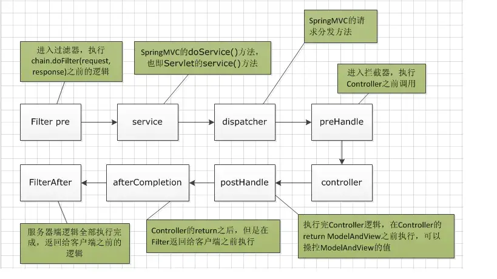

# 背景
Java 高并发项目

# 令牌大闸
- 引入原因：分布式锁和限流都不能解决机器人刷票的问题，1000个请求抢票，900个限流快速失败，另外100个有可能是同一个人在刷库
- 没有余票时，需要查库存才能知道没票，会影响性能，不如查令牌余量来的快
- 按照人和车次作为分布式锁的 key，当一个人获取到令牌后，先不要释放锁，这样可以防止用户重复刷取

# 前端增加验证码削弱瞬时高峰并防机器人刷票

# 使用 Sentinal 进行限流熔断降级
## 常见的限流算法
- 静态窗口限流：固定时间间隔
- 动态窗口限流：动态计算
  - 上述两个方案都难以应对突发流量的状况
- 漏桶限流：大流量进入，匀速流出。可以应对突发的大流量的状况
- 令牌桶限流：指定速度往桶中发放令牌
- 令牌大闸：在令牌桶的基础上再做控制上限

## 限流的流控效果
- 快速失败：被限流的请求直接抛异常
- Warmup： 即请求的 QPS 限流从开始的低值经过多少预热时长后逐渐升至设定的 QPS 阈值
- 排队等待：被限流的请求进入队列等待

## 限流的流控模式
- 直接
- 关联：对目标的限流是有条件的，需要关联的资源限流时，目标才会限流。用在两个资源有相互关系，比如下单和支付，在下单被限流时，那么支付也会被限流。
- 链路：可以指定从哪个入口进来的资源被限流


# 分布式锁解决库存超卖
## synchronized 能否解决超卖问题
- synchronized 只能保证单个机器上没有超卖问题，但在多个机器上依然会有超卖问题
- 加上锁以后性能明显降低，系统吞吐率下降
# 可以通过数据库来实现
- 锁的信息放在表中保存
- 所有节点都可以从表中获取锁
- 优点是相比于 synchronized 方案，可以保证多个机器上都没有并发问题，解决超卖问题
- 缺点是性能太差
# 使用 redis 分布式锁
- setIfAbsent/setnx: 设置 5s 超时
  ```
      Boolean setIfAbsent = redisTemplate.opsForValue().setIfAbsent(lockKey, lockKey, 5, TimeUnit.SECONDS);

      if (Boolean.TRUE.equals(setIfAbsent)) {
          LOG.info("恭喜，抢到锁了! lockKey: {}", lockKey);
      } else {
          LOG.info("很遗憾，没抢到锁! lockKey: {}", lockKey);
          throw new BusinessException(BusinessExceptionEnum.CONFIRM_NOT_LOCK);

      }
  ```
- 为了提升性能，将 key 设置为 日期+车次，这样不同车次不会相互影响，最大程度的提升性能
- 上述的设置锁的超时时间会有问题，如果业务的执行时间超过了设置的超时时间，那么后面其他线程都会因为超时而获取不到锁，从而影响业务的运行
- 上述问题的解决方案：使用 Redis 看门狗，可以自动刷新锁的超时时间，防止因为业务执行时间超过锁的过期时间而导致问题。比如业务执行需要10s，看门狗初始将锁设置为 30s超时，然后看门狗每隔 5s中刷新下锁的超时时间，所以从倒计时 30s 开始，当到了 25s 后，看门狗发现业务还未执行完成，就将锁的过期时间刷新到 30s，然后继续监控，直到业务执行完成并释放锁
- 上述看门狗的方案也会有问题：redis 如果宕机了，主备机切换后，锁的互斥性就失效了
- Redis 红锁可以解决上述的问题，但成本太高，实际生产环境中不常使用。


# 分布式事务组件 Seata
- Seata 是一款开源的分布式事务解决方案，致力于在微服务架构下提供高性能和简单易用的分布式事务服务
- 提供 4 种事务模式：AT、TCC、SAGA 和 XA
- 原理说明：
  - 在原先单体应用的时候，只需要在方法上添加事务后，那么方法内部的数据库操作都在一个事务内部，只要有一个操作失败了，就可以全部回滚，这就是单体应用的事务
  - 但是在分布式项目中，这种方法就失效了。因为每个服务背后的数据库都不一样，因此无法将其集中在一个事务中
  - Seata 分布式事务原理就是程序员只需要写业务的正向流程，而失败场景下的补偿、回滚等都由 Seata 来自动进行计算操作，就好比之前的单体应用的事务在发生异常时直接回滚
- AT 模式：默认、简单，需要增加 undo_log 表，生成反向 SQL，性能高
- TCC 模式：try、confirm、cancel 三个阶段的代码都需要自己实现，Seata 只负责调度。对业务代码侵入性较强，必要时可能还需要修改数据库
- SAGA 模式：长事务解决方案，需要程序员自己编写两阶段代码（AT 模式不需要写第二阶段）
- XA 模式：XA 协议是由 X/Open 组织提出的分布式事务处理规范，适用于强一致性的场景，比如金融

# Filter 和 Interceptor 的区别
- Filter 是过滤器，由 Servlet 容器提供，在请求进入容器后，在进入 Servlet 之前执行 Filter
- Interceptor 是拦截器，由 Spring 提供，可以获取 Spring 中的很多 Bean
- Filter 可以修改 request，而 Interceptor 不能




## Filter 应用场景
- 过滤敏感词汇（防止sql注入）
- 设置字符编码
- URL级别的权限访问控制
- 压缩响应信息

## Interceptor 应用场景
拦截器本质上是面向切面编程（AOP），符合横切关注点的功能都可以放在拦截器中来实现，主要的应用场景包括：

- 登录验证，判断用户是否登录。
- 权限验证，判断用户是否有权限访问资源，如校验token
- 日志记录，记录请求操作日志（用户ip，访问时间等），以便统计请求访问量。
- 处理cookie、本地化、国际化、主题等。
- 性能监控，监控请求处理时长等。
- 通用行为：读取cookie得到用户信息并将用户对象放入请求，从而方便后续流程使用，还有如提取Locale、Theme信息等，只要是多个处理器都需要的即可使用拦截器实现）


# 缓存
## 后端缓存
- MySql 一级缓存
  - 当方法上添加了事务后，对于完全相同的两次查询，第二次会直接使用一级缓存。如下：
    ```java
        @Service
        public class TrainService {
            // ...

            @Transactional
            public List<TrainQueryResp> queryAll() {
                List<Train> trainList = selectAll();
                
                // 第二次查询时，因为添加了事务，所以会直接使用一级缓存
                trainList = selectAll();
                return BeanUtil.copyToList(trainList, TrainQueryResp.class);
            }
        }

    ```
  - 可以配置关闭一级缓存，如下。这时候即使开启了事务，但依然会每都重新查询
    ```
        # 配置为 statement，也就是关闭了 mybatis 一级缓存
        mybatis.configuration.local-cache-scope=statement

    ```

- MySql 二级缓存
  - 多次查询同一个接口，只会在第一次查询时调用数据库，后续直接使用缓存，这个就是二级缓存
  - 二级缓存通过在 '/mapper/XxxMapper.xml' 文件中添加 '<cache></cache>'标签开启，同时需要注意对返回对象进行**序列化**，这样 mybatis 才能保存对象，并在下次查询时直接返回
  - 二级缓存的实效：执行增、删、改操作后，二级缓存会自动失效，即使增、删、改操作没有对数据库做任何的改动，Mybatis 都会将同个命名空间下的二级缓存清空
  - 二级缓存只存在当前机器上，所以如果一台机器执行了增、删、改后会清空二级缓存，而另一台机器没有清空二级缓存，会导致两台机器的查询结果不一致，是一个致命问题，因此一般生产环境中不做这种二级缓存

- 本地缓存(SpringBoot 缓存)：会有各节点不同步的问题
  - @Cacheable
  - 在 service 层直接缓存，不需要走后续的数据库查询，效率更高
  - 原理：开辟一块空间，根据不同的请求参数空间内会缓存多个结果，会根据请求参数的 hashCode 和 equals 方法判断当前对象是否已经在缓存中了，因此一定要对请求参数生成 hashCode 和 equals 方法，用于生成 key，同时在生成的时候要考虑请求参数的父类属性
  - 缺点：这个缓存和数据库中的数据无关，只要请求参数一致，就会返回缓存的内容
  - @CachePut: 强制刷新缓存，一般配合 @Cacheable 一起使用

- 分布式缓存(redis)：解决各节点不同的问题
  - 提高访问速度，mysql 单机 QPS 约为 2000，redis 约 10万
  - 实现多节点共享缓存，机器重启也不会丢失缓存数据
  - redis 常用于放用户的登录信息，早期没有 redis 时，登录信息都放在 session 中，应用一重启，登录就没有了，多节点 session 又是另一个头大的问题
  - 在开启上述 SpringBoot 缓存后（@Cacheable），直接增加下面的 redis 缓存配置后，就自动使用 redis 缓存替换 spring boot 的缓存：
    ```
    # redis 缓存
    spring.cache.type=redis
    spring.cache.redis.use-key-prefix=true
    spring.cache.redis.key-prefix=train12306_cache_
    spring.cache.redis.cache-null-values=true
    spring.cache.redis.time-to-live=10s
    ```
- 缓存失效
  - 一般缓存都会存在一个过期时间，如果在缓存过期后此时有大量的请求进来的话，会导致机器卡死，这个也就是缓存失效导致的问题
  - 解决方案1: 每隔一段时间去主动刷新缓存
  - 解决方案2: 增加分布式锁，只让一个请求成功，其他请求快速失败，让用户稍后重试
- 缓存穿透
  - 一般在使用缓存的时候会先判断缓存中有没有数据，如果有则直接使用缓存中的数据，如果没有再去查询数据库。而在数据库本身就没有数据的情况下，那么每次的缓存判断都会失败，这就是缓存穿透
  - 解决方案1: 需要区分下空列表和无缓存的情况
  - SpringBoot 中使用 redis 缓存后，只要开启允许 null，就会默认解决缓存穿透问题
- 缓存雪崩
  - 由于短时间内大量的 key 失效，导致数据库压力剧增
- 常见的缓存过期策略
  - TTL 超时时间
  - LRU 最近最少使用
  - LFU 最近最不经常使用
  - FIFO 先进先出
  - Random 随机淘汰策略

## 一个实际的缓存案例分享
- 场景：一个网站有很多会员，每天会员只会在一段时间内集中请求多次
- 问题：多次调用查询会员的方法，多次访问数据库
- 解决：使用本地缓存，1分钟内有效
- 问题：使用本地缓存后，会在短时间内产生大量的缓存对象，导致程序 fullgc 频繁，导致大量请求短时间内请求失败
- 解决：去掉本地缓存，使用线程本地变量
- 本场景的总结：缓存一般应用在读多写少的场景下，而且是对应同一个变量，本场景中由于每个会员的信息都不一样，如果都缓存下来就会很容易占满内存，从而导致 fullgc

## 前端缓存
- 前端 sessionStorage：会话期内
- 前端 localStorage：永久****

# 注册中心与配置中心

## 注册中心
- 注册中心就是通讯录，让应用之间互相认识
- 健康检查
- 路由转发：为了控制成本，会对机器作动态扩容，此时 ip 就不固定了，所以需要根据注册中心来按照名字调用，而不是根据机器 ip 来调用
- 远程调用

## 配置中心
- 动态修改线上的配置
- 常用做一些开关，支持动态修改
- 阈值等配置

## nacos
- 一个动态服务发现、配置管理和服务管理平台
- 支持动态配置
- 配合 gateway，实现按应用名来做路由转发，而不是机器 ip，如下：
```
# spring.cloud.gateway.routes[0].uri=http://127.0.0.1:8001

spring.cloud.gateway.routes[0].uri=lb://member
```
- 配合 OpenFeign 可以实现按照应用名进行远程服务调用，如下：
```java
@FeignClient("business")
// @FeignClient(name = "business", url = "http://127.0.0.1:8002/business")
public interface BusinessFeign {
  // ...
}
```

# 事务
- 在同一个类的方法之间调用，事务不生效，所以要想事务生效，需要调用不同类的方法

# 【前端】sessionStorage vs localStorage
localStorage 和 sessionStorage 属性允许在浏览器中存储 key/value 对的数据。

sessionStorage 用于临时保存同一窗口(或标签页)的数据，在关闭窗口或标签页之后将会删除这些数据。

**提示**: 如果你想在浏览器窗口关闭后还保留数据，可以使用 localStorage 属性， 该数据对象没有过期时间，今天、下周、明年都能用，除非你手动去删除。

# 远程调度 OpenFeign
Spring Cloud OpenFeign是一种基于Spring Cloud的声明式REST客户端，它简化了与HTTP服务交互的过程。它将REST客户端的定义转化为Java接口，并且可以通过注解的方式来声明请求参数、请求方式、请求头等信息，从而使得客户端的使用更加方便和简洁。同时，它还提供了负载均衡和服务发现等功能，可以与Eureka、Consul等注册中心集成使用。Spring Cloud OpenFeign能够提高应用程序的可靠性、可扩展性和可维护性，是构建微服务架构的重要工具之一。

- 使用 feign 来实现微服务之间的远程调度
- 具体实现可看: DailyTrainJob.java

# 定时调度任务

## Spring 自带的定时任务
- 在 Spring 中使用自带的调度功能比较简单，如下示例，开启一个 5s 的定时任务
```java
package com.train.batch.job;

import org.springframework.scheduling.annotation.EnableScheduling;
import org.springframework.scheduling.annotation.Scheduled;
import org.springframework.stereotype.Component;

@Component
@EnableScheduling
public class ScheduleDemo {

    @Scheduled(cron = "0/5 * * * * ?")
    private void test() {
        System.out.println("dida");
    }
}
```

- 一般这种定时任务只适用于单体应用，不适合集群。因为上述的 job 一般都不能重复跑，因此当上述代码部署到集群中后，每个应用都会跑这个 job，就会导致业务上的问题
- 虽然问题可以通过增加分布式锁来解决，但还是有其他问题，比如无法实时的更改定时任务的状态和策略

所以在实际企业应用中，一般使用第三方定时任务调度框架，比如下面的 quartz

## quartz
- 使用 quartz，需要实现 Job 接口
- 在配置中声明任务、触发器
- 详细代码可查看：QuartzDemo.java 和 QuartzConfig.java
- 
## 定时任务的并发执行问题
在定时任务中有一个很关键的问题就是任务的并发执行，假设上一个任务运行很耗时，超过了定时间隔，那么下一个任务不等上一个任务结束就立刻开启，两个人物并发运行会造成很多意想不到的问题。

上述的并发执行问题在 quartz 中可以通过添加 @DisallowConcurrentExecution 注解来解决。

## 使用数据库来控制 quartz
- 一般实际生产中都是通过数据库的配置来控制 quartz 的定时任务
- 具体可看 batch 模块中的代码
- 使用 OpenFeign 实现远程调度

# 日期序列化和反序列化问题
- 在前端传过来的时间往往是非标准的日期格式，后端在解析日期的时候会直接报错，如下是前端发送给后端的日期字符串：
```javascript
createTime: "2024-04-06 09:04:27"
```
- 要解决上述日期解析问题需要添加如下的标注来告诉后端如何解析当前的日期字符串。**注意**：发送给前端的日期序列化同样可以用下面的标注将 Date 对象序列化为日期字符串
```java
public class PassengerSaveReq {
    @JsonFormat(pattern = "yyyy-MM-dd HH:mm:ss", timezone = "GMT+8")
    private Date createTime;
}
```

# Long 精度丢失问题
- 由于 Java 中的 Long 类型的最大值要比 JS 中的 Long 最大值大很多，因此后端如果直接返回 Long 类型到前端，会有精度丢失的问题
- 解决办法是在返回的对象中对应字段上添加 Json 序列化，如下：
```java
public class PassengerQueryResp {
    
  @JsonSerialize(using= ToStringSerializer.class)
  private Long id;
  
  // ...
}
```

# 线程本地变量
- 可以将登陆信息存放到线程本地变量中(ThreadLocal)，方便后续直接使用,详细代码可参考 `LoginMemberContext`
- 通过拦截器来实现统一的处理
  - 拦截器定义：`MemberInterceptor`
  - 拦截器注册：`SpringMvcConfig`

# 短信验证码登陆
- 使用图形验证码来防止脚本模拟发短信进行攻击

# 雪花算法
- 使用系统 ms 来作为 ID 值的方式不适合高并发场景
- 自增 ID 不适合分布式数据库，在分表分库场景下有问题。只适合小项目
- uuid 方式也不行，生成的值是乱序的，会影响索引，从而导致性能损耗
- 基本原理：64 位
    - 最高位 1bit，不用
    - 41 bit 时间戳：保证了生成的 id 是增加的
    - 10 bit 工作机器 id
    - 12 bit 序列号：同一台机器一个 ms 内最多可以生成 4096 个不同 id，当同一台机器 1ms 内的并发数超过 4096 的话，那么会等待下一个 ms 来生成剩下的 id
- 需要的数据中心 id 和机器 id 的获取方式：可以在机器启动的时候，去 redis 中获取，或者从数据库中根据已经设置的机器 ip 和 id 的对应关系来获取
- 时钟回拨问题：当把机器时钟回拨后，可能会生成重复的 id，解决方案就是回拨时钟后，不让当前这台机器生成 id，当时间超过了回拨前的时间后，才继续生成 id

# 持续秒杀的高并发方案
## 前端
- 静态资源上CDN
- 页面静态化
- 秒杀读秒 + Loading
- 验证码削峰
## 后端
- 微服务
- 负载均衡
- 限流降级
- 令牌桶
- 缓存
- 异步处理
## 数据库
- 分库
- 读写分离
- 分表：横向、纵向
- 反范式设计：减少表关联次数、空间换时间
- 分布式数据库
## 其他
- 分时段秒杀
- 特有的业务逻辑：候补、排队

# Java9-17 新特性
## Java 9
### 模块化
- 更精确的控制要导出的包中的某些类，而不需要使用 private
- 使用 module-info.java 文件，通过 exports 来声明要导出的类、通过 requires 来声明要引入的类
## Java 10
### var 局部变量推导
- 需要保证当前变量可以推导出准确类型
- 必须初始化
- 只能用于局部变量
## Java 11

### 单文件程序
- 可以直接使用如下命令运行单个文件: ```java Demo.java```，而不再需要先编译，这个特性一般只是为了学习，实际生产中用不到

### shebang
- 通过 `#!` 来指定 java 版本，类似于 linux 中的 `#!bin/bash`

## Java 14

### 文本块
- 可以简单实现多行字符串，如下,通过 """ 来实现多行文本字符串

```java
String json = """
	{
		name: "test"
	}
""";
```
### instanceof 增强
- 在使用 instanceof 判断时，可以直接接赋值语句，如下：
```java
public class Demo {
    public static void main(String[] args) {
        Object a = "Hello world!";
        if (a instanceof String b) {
            System.out.println(b); // Hello world!
        }
    }
}
```

### 空指针提示
- 能够定位到具体为空的变量


## Java 16

### record 类
- 类似于 final 的特性，一旦初始化后，后面就不能再修改


## Java 17

### sealed 类
- 显式表明类继承

### switch 增强
- 可以和 instanceof 合并，简化判断和赋值的步骤，如下：
```java
public class Demo {
    public static void main(String[] args) {
        Object a = "Hello world!";

        switch (a) {
            case String b -> System.out.println(b);
            case Integer b -> System.out.println(b);
            case Long b -> System.out.println(b);
            default -> System.out.println("default");
        }
    }
}
```
# Spring Boot 3 新特性
## AOT
- Ahead of time: 预编译
- 启动运行速度更快：编译速度从原先的几秒降低到后面的几百毫秒，并且运行时没有 jvm，直接跟操作系统底层打交道，速度更快
- 打包体积更小
- 云原生

缺点：
- 编译后的程序不支持跨平台
- 不支持动态功能，比如 AOP

## JIT
- Just in time: 实时编译
- 没有 AOT 的缺点，但在高并发场景下会有一些问题，如下：
1. 热点业务在重启后一开始会业务超时，几分钟后会恢复正常
原因：启动后大量请求进来，导致多个类同时触发 JIT 超时，导致机器 CPU 升高，性能下降

底层原因：JVM 混合执行模式下，初期以解释方式执行，执行效率慢；当执行次数/频率达到指定阈值后，促发 JIT 编译，JIT 编译后，以机器指令码方式执行，执行效率提高。因此上述的问题本质是 JVM 的混合执行模式的机制

解决方案：
1. 先让程序进行预热，自己进行 JIT 编译
2. 做流量控制，后逐步放开流量
